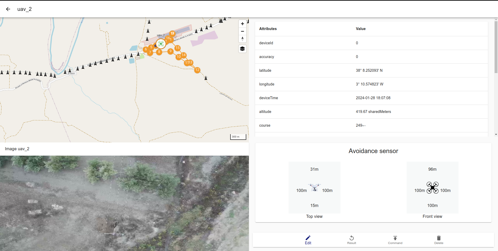

# MultiUAV-GUI 
[](https://github.com/alvcaballero/multiuav_gui/releases) [](https://doi.org/10.1109/ICUAS60882.2024.10556987)

A GCS for multi UAV  & long range inspection

This repository prvides an GCS software that allow command and monitoring multiple UAVs for a heterogeneous fleet of unmannned Aerial Vehicles (UAVs).
This project is part of [Multi Project](https://github.com/alvcaballero/multiUAV_system)


#### Table of Contents

- [Documentation](#documentation)
- [Features](#-features)
- [Development Setup](#development-setup)
  - [Local setup (Linux & Windows)](#local-setup-linux--windows)
  - [Run locally](#run-locally)
    - [Backend](#backend)
    - [Frontend](#frontend)
  - [Docker (Linux)](#docker-linux)
  - [Run on Docker containers](#run-on-docker-containers)
- [Production Setup](#production-setup)
  - [Local (Linux & Windows)](#local-linux--windows)
    - [Backend](#backend-1)
    - [Frontend](#frontend-1)
  - [Docker (Linux)](#docker-linux-1)

## Development Setup

First, clone the repo and cd into the project:

```bash
git clone https://github.com/alvcaballero/multiuav_gui.git
cd multiuav_gui
```

### Local setup (Linux & Windows)

Install dependencies:

```bash
cd server
npm i
cd ..
```

For case you comunicate through ros do you have to setup a docker container

1. Install Docker container and prepare the container

```bash
cd docker
docker build -t muavgcs:noetic .
```

2. modify the docker/container_run.sh and change the PROJECT_DIR value and run

```bash
cd docker
nano ./container_run.sh
```

3. put repos and in catkin

```
https://github.com/dji-sdk/Onboard-SDK.git
mkdir build
cd build
cmake..
sudo make -j7 install
cd ..

mkdir catkin_ws && cd carkin_ws
mkdir src && cd src
catkin_init_workspace

git clone --recurse-submodules --branch GimbalPitch -j8 https://github.com/alvcaballero/multiUAV_system.git
git clone https://github.com/miggilcas/Onboard-SDK-ROS
// git clone https://github.com/alvcaballero/multiUAV_system.git
// git clone https://github.com/alvcaballero/multiuav_gui.git
// git clone https://github.com/dji-sdk/Onboard-SDK-ROS
// git clone https://github.com/grvcTeam/grvc-utils.git
// git clone https://github.com/CircusMonkey/ros_rtsp.git
// git clone https://github.com/miggilcas/simple_vs.git

cd ..
catkin_make

```

### Run locally

#### Backend

Move to the server directory:

```bash
cd server
```

Open **.env.example** and copy its content into a new file named **.env**,
then set the correct value for all things. Now start the server:

```bash
npm run server
```

#### Frontend

Move to the client directory and run :

```bash
cd client
npm run start
```

Backend will be running on port **5000** and frontend on port **3000** (if not
already in use).

### RosBridge

Mode to the docker directory and run:

```bash
cd docker
./container_run.sh
```

In the container run for enable the rosbridge and GCS can connect with de UAVs

```bash
roslaunch aerialcore_gui connect_uas.launch
```

### Docker (Linux)

Open **.env.example** and copy its content into a new file named **.env**,
then set the correct value for all things.
Install dependencies:

```bash
docker-compose run server npm i
docker-compose run bridge roslaunch aerialcore_gui connect_uas.launch
```

### Run on Docker containers

```bash
docker-compose up
```

## Production Setup

### Local (Linux & Windows)

#### Frontend

Move to **./client/**

```bash
npm i -g serve
```

Build the app:

```bash
npm run build # Or yarn build
```

#### Backend

Move to **./server/** and open **.env.example** and copy its content into a new file named **.env**,
then set the correct value for all things. Now start the server:

```bash
npm run server
```

### Docker (Linux)

Build images and run containers:

```bash
docker-compose -f docker-compose.yml -f docker-compose.prod.yml up
```

## Documentation

The documentation of this project is [Documentation HERE](https://arpoma16.github.io/multiuav_gui_doc/)

## 📋 Features

- [x] **Multi-robot**: Allow monitoring and control multiple robot at same time or individual.

- [x] **Heterogeneity**: Each vehicle can possess distinct capabilities, including various velocities and battery requirements (maximum time of flight).

- [x] **Multi-User**: Interact with the web application to monitoring and control de robot fleet or a single robot can be access athrough internet or in local network.

- [x] **Third-party sotfware**: Interact with other software thought API like abstraction layer for big proyects.

- [x] **ROS easy integration**: Easy integration with diferents robot using ROS

- [x] **Mission Planning**: Allow create waypoint mission in the web interface and export in diferets formats.

- [x] **Mission Planning**: Allow create waypoint mission in the web interface and export in diferets formats.

- [x] **Video Straming from robot**: Actually allow integration to mavlink through ros packages mavros, in future use directly mavlink.

- [ ] **Mavlink integration**: Actually allow integration to mavlink through ros packages mavros, in future use directly mavlink.



## ⚙️ Installation

1. To install MultiUAV-GUI need node 18 and npm and docker, I remend use nvm for use npm .

2. Clone the repository.

```bash
git clone https://github.com/alvcaballero/multiuav_gui.git
cd multiuav_gui
```

3. Install the requirements of server.

```bash
cd server
npm install
```

## 🖥️ Usage

The web interface use [openStreatMaps](https://tile.openstreetmap.org/) and for elevation profile use [OpentopoData](https://www.opentopodata.org/)

1. Configure the server to modifi and edit .env and devices_init.yaml

```bash
cp multiuav_gui/server/.env.example multiuav_gui/server/.env
cp /multiuav_gui/server/config/devices/.devices_init.yaml' /multiuav_gui/server/config/devices/devices_init.yaml'

```

2. Run server

```bash
cd multiuav_gui/server
npm run server
```

3. Run rosbridge in docker

```
./container_run.sh
roslaunch aerialcore_gui connect_uas.launch

```

3. Open the interfaz in browser http://localhost:4000/

### optional use tmuxinator

Interface for control and monitoring of multiple UAV in mision

```
tmuxinator start -p muav-gui.yml
```

### optional develop web interface

for development of MUAV-GUI can access to http://localhost:3000/

```
cd multiuav_gui/client
nvm use 18
npm install
npm run start
```

## Documentation

you can see the documentacion for integration in [Documentation HERE](https://arpoma16.github.io/multiuav_gui_doc/)

additional docs

1. [Dependencias e instalacion de GCS](docs/HOWRUN.md)
1. [simulation PX4 Vtool](docs/Simulation-PX4.md)
1. [simulation PX4 Vtool](docs/Simulation-Ardupilot.md)
1. [UAV camera Stream](docs/CameraStream.md)

## Future Work

- Implement option to exchange ROS messages over the network,s messages using Flatbuffers without Ros on server like robofleet
- access control
- Data Bases model for maintain the information.

## Releases

### Last

- integration with external plannig

### Tag V1.4 (Download images form UAV)

### Tag V1.3

Test and Setup for Muav on Proyect Omicron Demo in Plaza de Agua

- Group points and move all route , in edit mission
- streaming of video using Websockets in MVS Architecture
- Donwload mission in diferentes file format

### Tag V1.2

- Calcule middle point for create a new mission

### Tag V1.1

- Creation mission page for eddit mission

## References and interesting project to help in develop

- [inspector software_UAV](https://github.com/AlejandroCastillejo/inspector_software_uav) in this project files from the camera are held via ftp and stored in the drone's backpack and then sent to the gcs via bashpass using and scp, this is done directly on the drone.

- [autonomus landing](https://github.com/MikeS96/autonomous_landing_uav/blob/master/Usage.md)

- [Robot Fleet](https://github.com/ut-amrl/robofleet) Open Source Communication and Management for Fleets of Autonomous Robots To exchange ROS messages over the network,s messages using Flatbuffers.

- [DJI ROS OSDK](https://github.com/miggilcas/Onboard-SDK-ROS) custom DJI ROS SDK package with all sensors avoidance and download camera images.

- [UAL](https://github.com/grvcTeam/grvc-ual) ROS UAV abstraction layer

- [altitude sensor](https://github.com/AlejandroCastillejo/sf11_altitude_sensor)

- [ROS_RTSP](https://github.com/CircusMonkey/ros_rtsp) publish video for robot to server

- [Mediamtx](https://github.com/bluenviron/mediamtx) Server multimedia for streaming video in server part

- [traccar-web](https://github.com/traccar/traccar-web) fleet management


## Citation
If you find UAL useful in your research, please consider citing:

```
@inproceedings{poma2024Icuas,
  title={Open-Source Web-Based Ground Control Station for Long-Range Inspection with Multiple UAV s},
  author={Poma, Alvaro Ramiro and Caballero, Alvaro and Maza, Ivan and Ollero, Anibal},
  booktitle={2024 International Conference on Unmanned Aircraft Systems (ICUAS)},
  pages={1385--1392},
  year={2024},
  organization={IEEE}
}

```
